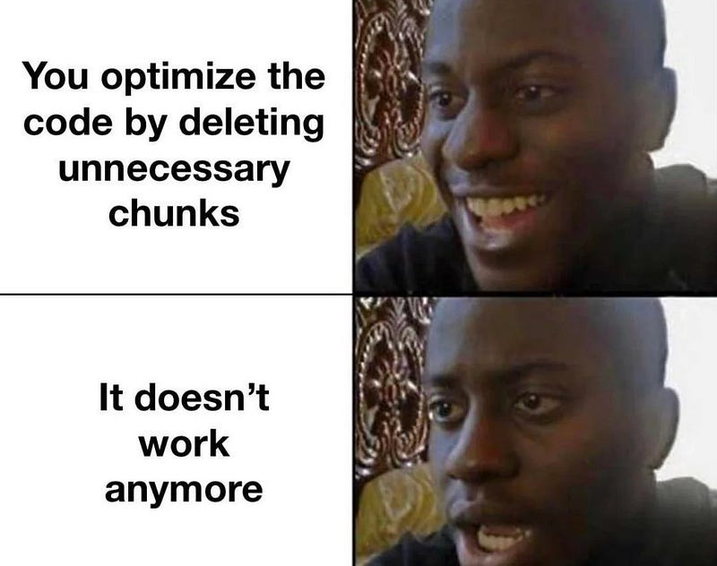

[Helm](https://helm.sh) is a powerful tool and de-facto standard to manage Kubernetes applications. With time, charts become complex and you really need to test your charts to avoid regressions. There are several ways and levels to do so. Here I'll explain what we finally do at my company with [helm-unittest](https://github.com/helm-unittest/helm-unittest).

At first, we followed the documentation and wrote stuff like:

```yaml
suite: test deployment
templates:
  - deployment.yaml
tests:
  - it: should work
    set:
      image.tag: latest
    asserts:
      - isKind:
          of: Deployment
      - matchRegex:
          path: metadata.name
          pattern: -my-chart$
      - equal:
          path: spec.template.spec.containers[0].image
          value: nginx:latest
```

We added such tests when creating a new feature or fix. This method searches for very specific items into the chart, which is nice.

However, with time, we found out that it doesn't scale well and more importantly, this doesn't cover regressions well enough. This concentrates on very specific checks: what if the value (`image.tag` here) you set in the test is used somewhere else in the chart? You might have forgotten it after weeks/months or a new contributor might not know it. This means one can break something without knowing it and make your end-users complain.



Hopefully, helm-unittest supports [snapshot testing](https://github.com/helm-unittest/helm-unittest?tab=readme-ov-file#snapshot-testing)! Just like other tools in the industry (like [jest](https://jestjs.io/docs/snapshot-testing)), it will compare the fully rendered chart to a snapshot taken earlier. Any difference in the rendered chart will be reported so you make sure that touching that one little thing isn't breaking anything somewhere else in the chart.
